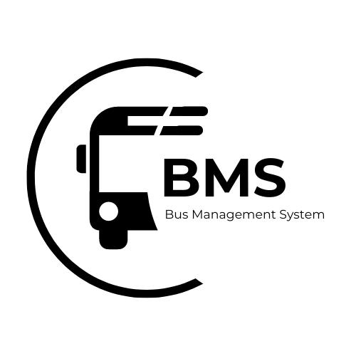

<p align="center">
    
</p>
<h1 align="center">
     Bus Management System - CSIT327 G5
</h1>

<p align="center">
    <strong>A modern solution for bus company administration, designed exclusively for administrators to manage operations efficiently.</strong>
</p>

## Table of Contents

1. [Project Description](#project-description)
2. [Features Overview](#features-overview)
   - [Bus Management](#bus-management)
   - [Schedule Management](#schedule-management)
   - [Repair & Maintenance Tracking](#repair-maintenance-tracking)
   - [Employee Management](#employee-management)
3. [Why Choose This System?](#why-choose-this-system)
4. [System Workflow](#system-workflow)
   - [How to Use](#how-to-use)
   - [System Modules](#system-modules)
5. [Technologies Used](#technologies-used)
6. [Setup Instructions](#setup-instructions)
   - [Step 1: Clone the Repository](#step-1-clone-the-repository)
   - [Step 2: Set Up the Virtual Environment](#step-2-set-up-the-virtual-environment)
   - [Step 3: Install Dependencies](#step-3-install-dependencies)
   - [Step 4: Configure the Database](#step-4-configure-the-database)
   - [Step 5: Run the Development Server](#step-5-run-the-development-server)
7. [Contributors](#contributors)
8. [Useful Links](#useful-links)
9. [License](#license)

---

## Project Description

The **Bus Management System (BMS)** is a comprehensive web application developed specifically for bus company administrators. It simplifies the management of various aspects, including bus operations, schedules, maintenance, and employee management. This system acts as a digital assistant, automating tasks and providing an intuitive platform to ensure smooth and efficient operation of the bus services.

---

## Features Overview

### Bus Management
This module allows administrators to manage bus-related data effectively. Administrators can add, update, and delete bus information such as bus capacity, type, registration details, and more. It provides a centralized view of all buses, helping the admin to keep track of their statuses, including whether they are available, in maintenance, or otherwise occupied.

### Schedule Management
The schedule management module enables admins to create and modify bus schedules. This includes assigning specific routes, departure times, and ensuring that buses run on time. The system allows for the optimization of routes and timings to meet the operational needs of the bus company, improving service efficiency.

### Repair & Maintenance Tracking
Administrators can log, track, and monitor maintenance activities and repairs for each bus in the fleet. The system ensures that buses are kept in excellent condition, preventing breakdowns or delays by providing maintenance logs and reminders.

### Employee Management
This module handles the management of driver and maintenance staff records. Admins can assign responsibilities to employees, track their working hours, and ensure that shifts and tasks are appropriately managed. The system also provides features for recording employee performance and attendance.

---

## Why Choose This System?

The Bus Management System offers a streamlined, user-friendly interface that reduces the administrative burden while improving overall operational efficiency. 

- **Centralized Data**: All bus-related information, schedules, employee records, and maintenance logs are stored in one system, making it easier for admins to access and manage everything in one place.
- **Efficiency at Its Best**: By automating repetitive tasks such as scheduling and maintenance tracking, this system saves valuable time and reduces human error.
- **Organized Workflow**: The system ensures that all activities—such as bus management, schedule changes, maintenance tracking, and employee management—are logged systematically and can be accessed easily.
- **Improved Decision-Making**: The system provides valuable insights that help improve decision-making by offering data on bus usage patterns, employee performance, and maintenance requirements.

---

## System Workflow

### How to Use:

1. **Admin Login**: Securely log into the system using your administrator credentials.
2. **Manage Operations**: Admins can add, update, and delete records related to buses, employees, and schedules.
3. **Monitor Repairs**: Track bus maintenance and ensure that repair tasks are completed on time.
4. **Optimize Schedules**: Review and modify bus schedules to ensure timely and efficient operations.

### System Modules:
| Module                | Functionality                              |
|-----------------------|--------------------------------------------|
| Bus Management        | Manage bus details (registration, type).  |
| Schedule Management   | Create and track schedules for buses.     |
| Maintenance Tracking  | Log and monitor repairs and maintenance.  |
| Employee Management   | Handle staff information and assignments. |

---
## 🛠️ **Technologies Used**

### **Languages**


### **Frameworks**
- **Django**: Backend framework for building scalable web applications.

---

## Setup Instructions

### Step 1: Clone the Repository

Open your terminal and run the following command to clone the repository:
```
git clone <repository_url>
```
Navigate to the project directory:
```
cd bus-management-system
```
### Step 2: Set Up the Virtual Environment

1. Create a virtual environment:

    ```
    python3 -m venv env
    ```

2. Activate the virtual environment:

    - On Windows:
    
    ```
    .\env\Scripts\activate
    ```

    - On macOS/Linux:
    
    ```
    source env/bin/activate
    ```

### Step 3: Install Dependencies

With the virtual environment activated, install the required dependencies by running:
```
pip install -r requirements.txt
```
### Step 4: Configure the Database

Run the following commands to configure and set up the database for the project:
```
python manage.py makemigrations python manage.py migrate
```
### Step 5: Run the Development Server

Start the Django development server with the following command:
```
python manage.py runserver
```
Once the server is running, you can access the application by navigating to:
```
http://127.0.0.1:8000/
```
---

## Contributors
- **Sendrijas, Jannah Lovelle B.**
- **Gare, Ragelo John C.**
- **Regis, John Lawrence C.**

---

## Useful Links

- **Gantt Chart**: [View here](https://cebuinstituteoftechnology-my.sharepoint.com/:x:/g/personal/johnlawrence_regis_cit_edu/EaQFBi_0vrVApMQGTguHb4ABAIY7ljqNPlHHa-oEgpGOTw?e=JrbJSy)
- **ERD**: [View here](https://online.visual-paradigm.com/share.jsp?id=333535313134392d31)
- **Figma Design**: [View here](https://www.figma.com/design/M2ifVE4d2JDDvvrJLUig13/Bus-Management-System?node-id=0-1&node-type=canvas)

---

## License

This project is developed for academic purposes only under the guidance of **CSIT327 Group 5**.

---

<p align="center">
 Built with dedication by Group 5 ✨
</p>
